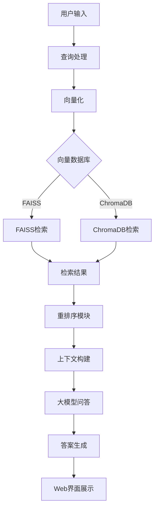

# RAG知识库问答系统

<div align="center">


**基于检索增强生成(RAG)的智能知识库问答系统**

支持多种向量数据库 | 智能检索策略 | 美观的Web界面 | 高性能问答

</div>

## 📋 目录

- [系统介绍](#-系统介绍)
- [功能特性](#-功能特性)
- [系统架构](#-系统架构)
- [快速开始](#-快速开始)
- [安装配置](#-安装配置)
- [向量数据库](#-向量数据库)
- [Web界面使用](#-web界面使用)
- [配置说明](#-配置说明)
- [注意事项](#-注意事项)
- [故障排除](#-故障排除)
- [性能优化](#-性能优化)
- [项目结构](#-项目结构)

## 🎯 系统介绍

RAG知识库问答系统是一个基于检索增强生成（Retrieval-Augmented Generation）技术的智能问答系统。系统能够理解用户问题，从知识库中检索相关信息，并生成准确、有引用依据的答案。

**核心优势：**
- 🚀 **高性能检索**：支持FAISS和ChromaDB两种向量数据库
- 🧠 **智能问答**：基于通义千问大模型的问答生成
- 🔍 **多种检索策略**：语义搜索、混合搜索、智能搜索等
- 📊 **可视化界面**：基于Streamlit的美观Web界面
- 🎯 **精确重排序**：使用gte-rerank-v2模型提升检索精度

## ✨ 功能特性

### 🔍 检索功能
- **语义搜索**：基于向量相似度的语义理解检索
- **混合搜索**：结合语义搜索和关键词匹配
- **智能搜索**：自动选择最佳检索策略
- **过滤搜索**：支持元数据过滤的精确检索
- **多查询融合**：多个查询结果的智能融合

### 🧠 问答功能
- **上下文问答**：基于检索结果生成准确答案
- **引用标注**：答案自动标注来源文档
- **置信度评估**：智能评估答案可信度
- **对话历史**：支持多轮对话上下文
- **批量问答**：支持批量问题处理

### 🗄️ 向量数据库
- **FAISS支持**：高性能向量检索，支持多种索引类型
- **ChromaDB支持**：智能向量数据库，易于使用
- **自动切换**：Web界面支持实时切换数据库类型
- **性能监控**：实时监控检索性能和存储状态

### 🎨 Web界面
- **直观操作**：简洁美观的用户界面
- **实时问答**：即时问答体验
- **结果可视化**：问答结果和性能指标可视化
- **系统监控**：实时系统状态和统计信息

## 🏗️ 系统架构



## 🚀 快速开始

### 方法一：使用自动启动脚本（推荐）

#### Linux/Mac用户：
```bash
# 1. 克隆项目
git clone <repository-url>
cd my_rag_system

# 2. 配置API密钥
cp env_template.txt .env
# 编辑.env文件，填入您的DASHSCOPE_API_KEY

# 3. 一键启动（自动检查环境并启动）
./start.sh
```

#### Windows用户：
```batch
# 1. 克隆项目
git clone <repository-url>
cd my_rag_system

# 2. 配置API密钥
copy env_template.txt .env
# 编辑.env文件，填入您的DASHSCOPE_API_KEY

# 3. 一键启动（自动检查环境并启动）
start.bat
```

### 方法二：手动启动

```bash
# 1. 安装依赖
pip install -r requirements.txt

# 2. 配置API密钥
export DASHSCOPE_API_KEY="your_api_key_here"

# 3. 启动Web界面
streamlit run src/web_interface.py
```

### 访问系统
启动成功后，浏览器将自动打开：`http://localhost:8501`

### 启动脚本选项
```bash
# Linux/Mac
./start.sh                # 完整检查并启动
./start.sh --check        # 仅检查环境
./start.sh --port 8502    # 指定端口
./start.sh --quick        # 快速启动模式

# Windows
start.bat                 # 自动检查并启动
```

## ⚙️ 安装配置

### 环境要求
- **Python**: 3.8+
- **内存**: 建议8GB+
- **存储**: 建议10GB+可用空间

### 安装步骤

1. **创建虚拟环境**
```bash
python -m venv venv
source venv/bin/activate  # Linux/Mac
# 或
venv\Scripts\activate     # Windows
```

2. **安装依赖包**
```bash
pip install -r requirements.txt
```

3. **配置API密钥**

创建`.env`文件或设置环境变量：
```bash
# 通义千问API密钥
export DASHSCOPE_API_KEY="sk-your-dashscope-api-key"
```

4. **初始化数据**

如果有Excel数据文件，运行数据处理：
```bash
python src/run_data_processing.py
```

如果需要快速设置测试数据：
```bash
python src/quick_setup.py
```

## 🗄️ 向量数据库

系统支持两种向量数据库，可以根据需求选择：

### FAISS (Facebook AI Similarity Search)
**适用场景**：大规模数据、高性能要求

**特点**：
- ⚡ 极高的检索速度
- 🎯 支持多种索引类型
- 📈 适合大规模向量数据
- 🔧 可配置索引参数

**索引类型选择**：
```python
# 精确搜索（推荐）
FAISS_INDEX_TYPE = "IndexFlatIP"  # 内积相似度

# 大数据量近似搜索
FAISS_INDEX_TYPE = "IVFFlat"     # 倒排索引
```

### ChromaDB
**适用场景**：中小规模数据、易用性优先

**特点**：
- 🏗️ 智能向量数据库
- 🛠️ 易于使用和管理
- 📊 内置HNSW索引
- 🔄 自动数据持久化

### 选择建议

| 数据规模 | 性能要求 | 推荐数据库 | 原因 |
|---------|---------|-----------|------|
| < 10万条 | 一般 | ChromaDB | 易用性好，性能足够 |
| 10万-100万条 | 高 | FAISS | 高性能，可配置 |
| > 100万条 | 极高 | FAISS | 大规模数据优化 |

## 🎨 Web界面使用

### 主要功能区域

#### 1. 侧边栏控制
- **向量数据库选择**：FAISS/ChromaDB切换
- **系统状态显示**：文档数量、存储大小等
- **搜索参数设置**：检索策略、文档数量等

#### 2. 智能问答
- **问题输入**：输入您的问题
- **实时回答**：获得AI生成的答案
- **引用展示**：查看答案的来源文档
- **性能指标**：查看响应时间、置信度等

#### 3. 文档搜索
- **关键词搜索**：直接搜索相关文档
- **结果预览**：查看搜索到的文档内容
- **相关性评分**：查看文档相关性分数

#### 4. 系统分析
- **性能监控**：实时系统性能数据
- **使用统计**：问答次数、响应时间等
- **数据库状态**：向量数据库详细信息

### 使用流程

1. **选择向量数据库**
   - 在侧边栏选择FAISS或ChromaDB
   - 查看数据库特性说明

2. **初始化系统**
   - 点击"初始化系统"按钮
   - 等待系统加载完成

3. **开始问答**
   - 在问答界面输入问题
   - 查看AI生成的答案和引用
   - 调整搜索参数以优化结果

4. **监控性能**
   - 在系统分析页面查看性能指标
   - 根据需要调整参数优化性能

## 📝 配置说明

### 主要配置文件：`src/config.py`

#### 模型配置
```python
EMBEDDING_MODEL = "text-embedding-v3"    # 嵌入模型
RERANK_MODEL = "gte-rerank-v2"          # 重排序模型
QA_MODEL = "qwen-max"                   # 问答模型
```

#### 向量存储配置
```python
VECTOR_STORE_TYPE = "chroma"            # 默认数据库类型
VECTOR_STORE_PATH = PROJECT_ROOT / "vector_store"
FAISS_INDEX_TYPE = "IndexFlatIP"        # FAISS索引类型
```

#### 检索配置
```python
TOP_K = 10                              # 默认检索数量
RERANK_TOP_K = 3                        # 重排序后保留数量
DEFAULT_SEARCH_METHOD = "hybrid"        # 默认检索方式
```

#### API配置
```python
QWEN_BASE_URL = "https://dashscope.aliyuncs.com/compatible-mode/v1"
```

## ⚠️ 注意事项

### 🔑 API密钥配置
- **必须配置**：`DASHSCOPE_API_KEY`环境变量
- **获取方式**：访问[阿里云百炼平台](https://bailian.console.aliyun.com/)
- **安全提醒**：不要将API密钥提交到代码仓库

### 📊 数据准备
- **格式要求**：支持Excel、JSON等格式
- **编码要求**：确保文件使用UTF-8编码
- **大小限制**：单个文档建议不超过1MB

### 🗄️ 向量数据库选择
- **数据规模**：根据数据量选择合适的数据库
- **性能要求**：高性能需求选择FAISS
- **易用性**：简单使用选择ChromaDB

### 💾 存储空间
- **向量存储**：每1万个文档约需100MB空间
- **缓存文件**：系统会生成多个缓存目录
- **日志文件**：定期清理日志避免占用过多空间

### 🔧 性能优化
- **内存使用**：大规模数据建议16GB+内存
- **并发限制**：避免同时运行多个实例
- **缓存管理**：定期清理过期缓存文件

## 🔧 故障排除

### 常见问题

#### 1. API密钥错误
**现象**：`API密钥未配置`错误
**解决**：
```bash
export DASHSCOPE_API_KEY="your_api_key"
```

#### 2. 依赖包安装失败
**现象**：`ImportError`或包版本冲突
**解决**：
```bash
pip install --upgrade pip
pip install -r requirements.txt --force-reinstall
```

#### 3. 向量数据库初始化失败
**现象**：`向量数据库不存在`错误
**解决**：
```bash
python src/quick_setup.py  # 快速设置测试数据
```

#### 4. 内存不足
**现象**：系统运行缓慢或崩溃
**解决**：
- 减少`CHUNK_SIZE`和`TOP_K`参数
- 选择更小的模型
- 增加系统内存

#### 5. Web界面无法访问
**现象**：浏览器无法打开界面
**解决**：
```bash
streamlit run src/web_interface.py --server.port 8501
```

### 日志查看
```bash
# 查看系统日志
tail -f logs/rag_system.log

# 查看Web界面日志
streamlit run src/web_interface.py --logger.level debug
```

## 🚀 性能优化

### 向量数据库优化

#### FAISS优化
```python
# 大数据量使用IVF索引
FAISS_INDEX_TYPE = "IVFFlat"

# 调整聚类中心数量
nlist = int(4 * math.sqrt(n_vectors))
```

#### ChromaDB优化
```python
# 调整批处理大小
batch_size = 1000

# 启用持久化
persist_directory = "./vector_store"
```

### 检索优化
```python
# 调整检索参数
TOP_K = 20                    # 增加候选数量
RERANK_TOP_K = 5             # 重排序保留更多结果
DEFAULT_HYBRID_ALPHA = 0.8   # 调整混合搜索权重
```

### 缓存优化
```python
# 启用各级缓存
embedding_cache_enabled = True
rerank_cache_enabled = True
qa_cache_enabled = True

# 调整缓存大小
max_cache_size = 10000
```

### 并发优化
```python
# Web界面并发设置
streamlit run src/web_interface.py --server.maxUploadSize 200
```

## 📁 项目结构

```
my_rag_system/
├── README.md                    # 项目说明文档
├── 使用注意事项.md               # 详细使用注意事项
├── requirements.txt             # Python依赖包
├── start.sh                     # Linux/Mac启动脚本
├── start.bat                    # Windows启动脚本
├── env_template.txt             # 环境配置模板
├── run.sh                       # 旧版启动脚本
├── data/                        # 原始数据目录
├── vector_store/                # 向量数据库存储
│   ├── chroma/                  # ChromaDB数据
│   ├── faiss_index.bin          # FAISS索引文件
│   └── metadata.json            # 元数据文件
├── cache/                       # 系统缓存目录
├── qa_cache/                    # 问答缓存目录
├── embeddings_cache/            # 嵌入缓存目录
├── logs/                        # 日志文件目录
└── src/                         # 源代码目录
    ├── config.py                # 系统配置
    ├── data_processing.py       # 数据处理模块
    ├── embedding.py             # 嵌入模块
    ├── vector_store.py          # 向量存储模块
    ├── retrieval.py             # 检索模块
    ├── reranking.py             # 重排序模块
    ├── qa_engine.py             # 问答引擎
    ├── web_interface.py         # Web界面
    ├── quick_setup.py           # 快速设置脚本
    ├── run_*.py                 # 各模块运行脚本
    └── test_*.py                # 测试脚本
```

### 核心模块说明

| 模块 | 功能 | 主要类 |
|------|------|--------|
| `data_processing.py` | 数据预处理和文档分割 | `DataProcessor` |
| `embedding.py` | 文档向量化 | `EmbeddingEngine` |
| `vector_store.py` | 向量存储管理 | `VectorStoreManager` |
| `retrieval.py` | 检索策略实现 | `RetrievalEngine` |
| `reranking.py` | 结果重排序 | `RerankingEngine` |
| `qa_engine.py` | 问答生成 | `QAEngine` |
| `web_interface.py` | Web用户界面 | `RAGWebInterface` |

## 📞 支持与贡献

### 获取帮助
- 查看本文档的故障排除部分
- 检查系统日志文件
- 确认API密钥和依赖包配置

### 贡献指南
- 遵循代码风格规范
- 添加必要的测试用例
- 更新相关文档

---

<div align="center">

**感谢使用RAG知识库问答系统！**

如有问题请查看[故障排除](#-故障排除)部分或检查系统日志

</div> 